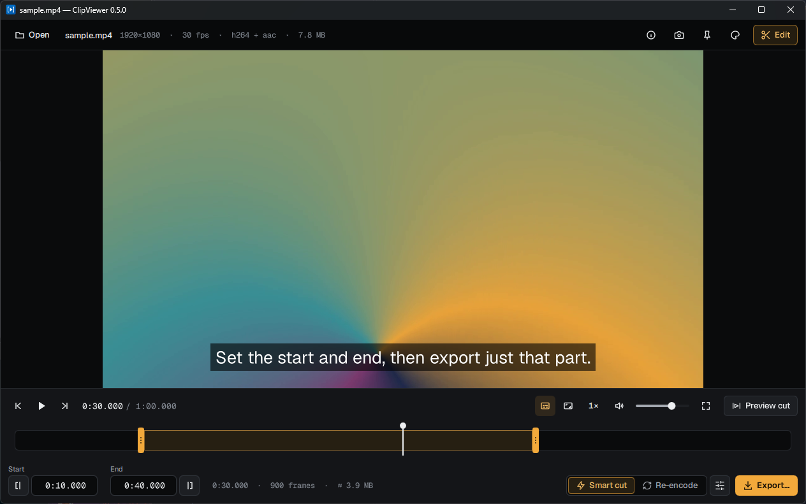
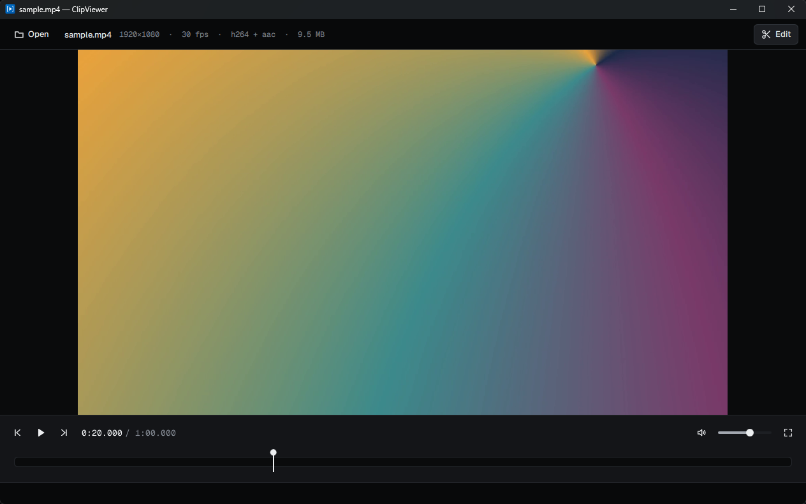

# ClipViewer Desktop

[](https://github.com/DevRuto/ClipViewerDesktop/actions/workflows/windows.yml)
[](https://github.com/DevRuto/ClipViewerDesktop/actions/workflows/linux.yml)

A local video player with a trim editor. You can open a video, set the start and end points to
the exact frame, and export that range to a new MP4. It's written in C++20 with Qt 6 (Qt Quick).
Export and still frames use FFmpeg, run as an external program.



<details>
<summary>The player, without the editor</summary>



</details>

It's built for Windows, Linux and macOS, but only Windows has been tested.

> **Note:** Linux and macOS haven't been tested. CI builds the project on Linux and runs the
> automated tests there, but nobody has run the app on Linux yet. macOS hasn't been built at all.

## Requirements

- Qt 6.12, with the Qt Multimedia, Qt Shader Tools, Qt Image Formats and Qt TaskTree modules
  (TaskTree only keeps a QML plugin that depends on it from warning at configure time)
- A C++20 compiler: MinGW 13.1 on Windows, GCC 13+ or Clang on Linux, Xcode's Clang on macOS
- CMake 3.25 or later, and Ninja
- FFmpeg (`ffmpeg` and `ffprobe`) on PATH, only for running a dev build and the integration tests.
  Release builds bundle their own.

One way to install Qt is with aqtinstall. Its latest release (3.3.0) can't read the per-compiler
layout Qt uses for Windows builds since 6.11, so install it from a pinned commit until 3.4.0 is out:

```sh
pip install --user "aqtinstall @ git+https://github.com/miurahr/aqtinstall.git@076e1659807d0b362a3ed684d54c2e9c775eb9c7" cmake ninja

# Windows (with MinGW), into C:\Qt
python -m aqt install-qt windows desktop 6.12.0 win64_mingw -m qtmultimedia qtshadertools qtimageformats qttasktree -O C:\Qt
python -m aqt install-tool windows desktop tools_mingw1310 qt.tools.win64_mingw1310 -O C:\Qt

# Linux
python -m aqt install-qt linux desktop 6.12.0 linux_gcc_64 -m qtmultimedia qtshadertools qtimageformats qttasktree -O ~/Qt

# macOS
python -m aqt install-qt mac desktop 6.12.0 clang_64 -m qtmultimedia qtshadertools qtimageformats qttasktree -O ~/Qt
```

On Linux you also need the OpenGL and XKB development packages (on Debian/Ubuntu:
`libgl1-mesa-dev libxkbcommon-dev`).

## Presets

| OS | Dev build | Release build |
| --- | --- | --- |
| Windows | `debug` | `release` |
| Linux, macOS | `unix-debug` | `unix-release` |

The Windows presets expect Qt in `C:\Qt\6.12.0\mingw_64` and MinGW in `C:\Qt\Tools\mingw1310_64`.
If yours are somewhere else, override `QT_ROOT` / `MINGW_ROOT` in a `CMakeUserPresets.json`.

The Linux/macOS presets find Qt through the `QT_ROOT` environment variable:

```sh
export QT_ROOT=~/Qt/6.12.0/gcc_64      # Linux
export QT_ROOT=~/Qt/6.12.0/macos       # macOS
```

## Development

```sh
cmake --preset debug              # configure into build/debug (unix-debug on Linux/macOS)
cmake --build --preset debug      # build
ctest --preset debug              # run the tests
```

On Windows, the presets put Qt and MinGW on PATH for building and testing, but not for running
the exe. Add Qt's `bin` folder to PATH before you start the app:

```powershell
$env:PATH = "C:\Qt\6.12.0\mingw_64\bin;$env:PATH"
.\build\debug\ClipViewerDesktop.exe path\to\video.mp4
```

On Linux, run `build/unix-debug/ClipViewerDesktop`. On macOS, run
`build/unix-debug/ClipViewerDesktop.app/Contents/MacOS/ClipViewerDesktop`.

Qt sends its log to the debugger on Windows. Set `QT_FORCE_STDERR_LOGGING=1` to print QML
warnings and errors to the console.

The code is split into three parts: `core/` is the UI-free library, with the media and FFmpeg
logic. `app/` is the Qt Quick executable. `tests/` holds the Qt Test suites.

## Production build

```sh
cmake --preset release                          # unix-release on Linux/macOS
cmake --build --preset release
cmake --install build/release --prefix dist
```

This gives a self-contained app in `dist` that you can zip and ship as is. It includes Qt's
libraries, QML modules and plugins, and FFmpeg:

- Windows: `dist/bin/ClipViewerDesktop.exe`, with FFmpeg in `dist/bin/ffmpeg/`
- Linux: `dist/bin/ClipViewerDesktop`, with Qt in `dist/lib/` and FFmpeg in
  `dist/bin/ffmpeg/`
- macOS: `dist/ClipViewerDesktop.app`, with FFmpeg in `Contents/MacOS/ffmpeg/`

### Releases

Pushing a tag like `v1.2.3` runs `.github/workflows/release.yml`. It builds every platform and
publishes a GitHub release with these files (a tag with a suffix, like `v1.2.3-beta.1`, makes a
pre-release):

- Windows x64: an installer (Inno Setup, `packaging/windows/ClipViewerDesktop.iss`) and a
  portable zip
- Linux x64: an AppImage and a `.tar.gz`
- macOS arm64 and x64: a `.dmg` and a zipped `.app`, ad-hoc signed only
- `SHA256SUMS.txt`

The tag is the version; there's no version number to edit in the source. The title bar shows it,
and other builds show `git describe` (`1.2.3-4-gabc1234` four commits after `v1.2.3`, plus
`-dirty` with uncommitted changes). `-DCLIPVIEWER_VERSION=...` overrides it.

The release goes out as long as the Windows build succeeds. A failed Linux or macOS build leaves
its files out. To build the packages without a release, run the workflow by hand from the
Actions tab; the files are attached to the run as artifacts.

### Code signing

The releases aren't code-signed, and there are no plans to sign them. Signing needs a paid
certificate (Windows) or Apple Developer membership (macOS). The first time you run the app, the
OS will warn you:

- **Windows:** SmartScreen says "Windows protected your PC". Click **More info**, then
  **Run anyway**.
- **macOS:** the app is only ad-hoc signed and not notarized, so Gatekeeper blocks it. Right-click
  the app, choose **Open**, then **Open** again. If it says the app is damaged, run
  `xattr -dr com.apple.quarantine /Applications/ClipViewerDesktop.app`.
- **Linux:** there's no OS signing to worry about.

To make sure you have an unmodified download, compare its hash against `SHA256SUMS.txt` in the
release.

### FFmpeg in the release build

The release presets set `CLIPVIEWER_BUNDLE_FFMPEG=ON`. When you configure, CMake downloads a
pinned FFmpeg build and checks its SHA-256. The download is cached in
`build/<preset>/_deps`, so it only happens once. The FFmpeg version is 9.0.2 on every platform:

- Windows x64: the [gyan.dev](https://www.gyan.dev/ffmpeg/builds/) "essentials" build. It also
  runs on Windows on Arm, under emulation.
- Linux and macOS (x64 and arm64): [Martin Riedl's builds](https://ffmpeg.martin-riedl.de/)

To build offline, or to bundle a different build, point CMake at a folder that contains
`ffmpeg` and `ffprobe`:

```sh
cmake --preset release -DCLIPVIEWER_FFMPEG_DIR=/path/to/ffmpeg/bin
```

To bump the version, update `CLIPVIEWER_FFMPEG_VERSION`, the URLs and the hashes in
`cmake/BundleFfmpeg.cmake`.

These FFmpeg builds are GPL-licensed. They ship as separate programs next to the app, and the
Windows build includes its `LICENSE`. If you distribute the app, you must meet the GPL's terms
for FFmpeg, including the offer of its source code.

The app looks for FFmpeg in this order: the bundled `ffmpeg/` folder (or `ffmpeg/bin/`) next to
the executable, then `%LOCALAPPDATA%\ClipViewerDesktop\ffmpeg` (or the platform's app data
folder), then PATH. Without FFmpeg, the app still starts and plays videos, but it can't export
and shows a warning in the status bar.

## License

The app's own code is under the [MIT License](LICENSE). Third-party parts keep their own
licenses: Qt is used under the LGPL v3 (linked dynamically, so its DLLs can be swapped), the
bundled FFmpeg is GPL (see above), and the Geist fonts are under the SIL Open Font License
(`app/assets/fonts/OFL.txt`).
